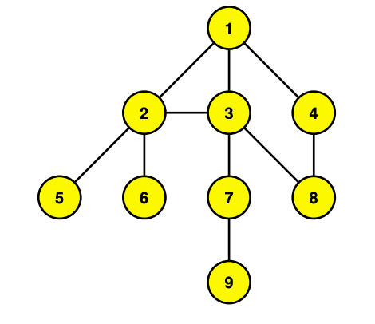

# Breadth-First Search (BFS)

## Authors
- Emilio Popovits Blake (A01027265)
- Patricio Tena (A01027293)
- Ana Paola Minchaca (A01026744)
- Rodrigo Benavente (A01026973)

## Instructions
An undirected graph *G=(V,E)* specified by the set {(*i*, *j*) | where *i*, *j* &isin; {1, ... , *n*} are nodes of *G*.}

As a sample input format was not specified in the instructions, the input format was inferred with the use of the following context based on the well defined mathematical input above.

### Context
A graph is an ordered pair *G(V,E)* where *V* is a set of vertices and *E* is a set of edges.

Nodes are typically represented as *vi*, where *i* &isin; {1, ... , #(*V*)}, while edges are represented by pairs of the form (*va*, *vb*), where *a*, *b* &isin; {1, ... , #(*V*)}.

From this, the inferred input will look more or less as follows:

```sh
G = [[v1,...,vn],[[v1,v2],[v1,v3],...,[va,vb]]]
```

## Input
Each undirected graph must be saved as a .txt file individually inside '/Graphs' directory for the program to run properly in the following format:

```sh
[[v1,...,vn],[[v1,v2],[v1,v3],...,[va,vb]]]
```

In more simple terms, `[V,E]`, where *V* is an array of nodes of the tree and *E* is an array of edges. Each edge within the edges *E* array is written as an array `[va,vb]`.

### Sample Input
This sample input describes the undirected graph shown in the Breadth-First Search presentation in class:
```sh
[[v1,v2,v3,v4,v5,v6,v7,v8,v9],[[v1,v2],[v1,v3],[v1,v4],[v2,v1],[v2,v3],[v2,v5],[v2,v6],[v3,v1],[v3,v2],[v3,v7],[v3,v8],[v4,v1],[v4,v8],[v5,v2],[v6,v2],[v7,v3],[v7,v9],[v8,v3],[v8,v4],[v9,v7]]]
```



## Output

This program outputs a visualization of *G* as it is traversed (every iteration), together with queue *Q* and array *A*.

In addition, it displays an ordered list *L* of nodes of *G*, where the order of *L* is that of traversing *G* by BFS.

### Sample Output:
```sh
Files in ./Graphs/ directory:
1. /sampleinput.txt

Which file number contains the undirected graph G that you want to run BFS on?: 1

Recieved undirected graph G string:
[[v1,v2,v3,v4,v5,v6,v7,v8,v9],[[v1,v2],[v1,v3],[v1,v4],[v2,v1],[v2,v3],[v2,v5],[v2,v6],[v3,v1],[v3,v2],[v3,v7],[v3,v8],[v4,v1],[v4,v8],[v5,v2],[v6,v2],[v7,v3],[v7,v9],[v8,v3],[v8,v4],[v9,v7]]]

Node Graph (Table form):
Node    Neighbors
---------------------------
v1       ['v2', 'v3', 'v4']
v2       ['v1', 'v3', 'v5', 'v6']
v3       ['v1', 'v2', 'v7', 'v8']
v4       ['v1', 'v8']
v5       ['v2']
v6       ['v2']
v7       ['v3', 'v9']
v8       ['v3', 'v4']
v9       ['v7']

Initial Condition:
----------------------------
Queue Q: ['v1']
Visited Array A: ['v1']

Iteration 1:
----------------------------
Popped Node v1 From Q
Neighbors to add to Q and A:  ['v2', 'v3', 'v4']
Q: ['v4', 'v3', 'v2']
A: ['v1', 'v2', 'v3', 'v4']

Iteration 2:
----------------------------
Popped Node v2 From Q
Neighbors to add to Q and A:  ['v5', 'v6']
Neighbors to discard from adding to Q and A:  ['v1', 'v3']
Q: ['v6', 'v5', 'v4', 'v3']
A: ['v1', 'v2', 'v3', 'v4', 'v5', 'v6']

Iteration 3:
----------------------------
Popped Node v3 From Q
Neighbors to add to Q and A:  ['v7', 'v8']
Neighbors to discard from adding to Q and A:  ['v1', 'v2']
Q: ['v8', 'v7', 'v6', 'v5', 'v4']
A: ['v1', 'v2', 'v3', 'v4', 'v5', 'v6', 'v7', 'v8']

Iteration 4:
----------------------------
Popped Node v4 From Q
Neighbors to add to Q and A:  []
Neighbors to discard from adding to Q and A:  ['v1', 'v8']
Q: ['v8', 'v7', 'v6', 'v5']
A: ['v1', 'v2', 'v3', 'v4', 'v5', 'v6', 'v7', 'v8']

Iteration 5:
----------------------------
Popped Node v5 From Q
Neighbors to add to Q and A:  []
Neighbors to discard from adding to Q and A:  ['v2']
Q: ['v8', 'v7', 'v6']
A: ['v1', 'v2', 'v3', 'v4', 'v5', 'v6', 'v7', 'v8']

Iteration 6:
----------------------------
Popped Node v6 From Q
Neighbors to add to Q and A:  []
Neighbors to discard from adding to Q and A:  ['v2']
Q: ['v8', 'v7']
A: ['v1', 'v2', 'v3', 'v4', 'v5', 'v6', 'v7', 'v8']

Iteration 7:
----------------------------
Popped Node v7 From Q
Neighbors to add to Q and A:  ['v9']
Neighbors to discard from adding to Q and A:  ['v3']
Q: ['v9', 'v8']
A: ['v1', 'v2', 'v3', 'v4', 'v5', 'v6', 'v7', 'v8', 'v9']

Iteration 8:
----------------------------
Popped Node v8 From Q
Neighbors to add to Q and A:  []
Neighbors to discard from adding to Q and A:  ['v3', 'v4']
Q: ['v9']
A: ['v1', 'v2', 'v3', 'v4', 'v5', 'v6', 'v7', 'v8', 'v9']

Iteration 9:
----------------------------
Popped Node v9 From Q
Neighbors to add to Q and A:  []
Neighbors to discard from adding to Q and A:  ['v7']
Q: []
A: ['v1', 'v2', 'v3', 'v4', 'v5', 'v6', 'v7', 'v8', 'v9']

Finished Iterating.

Order L of traversing graph G by BFS:
----------------------------
L:  ['v1', 'v2', 'v3', 'v4', 'v5', 'v6', 'v7', 'v8', 'v9']
```